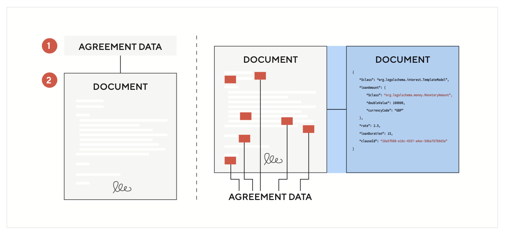

The Legal Schema is an open source initiative that provides a common language for creating and managing legal documents as data, much like [schema.org](https://schema.org) does for webpages. 

As we move towards a widespread digitisation of the contracting process (reflecting the digitisation of most aspects of society), the need for this common language is pressing. In the same way that schemas underpin and enable web development, the UKLS not only supports the development of individual digital contracts but, importantly, it enables them to interact with each other (and existing technologies). The result being that the emerging smart contract and digital asset industries in the UK can benefit from both strong legal and technical foundations.

The UKLS provides the first step towards this necessary technical foundation to support the mainstream adoption of digital documents (including smart contracts) developing the [Accord Project](https://accordproject.org) core.

Contracts are typically documented in word-processed formats. Even though represented in digital form they remain purely textual documents. By contrast, a digital contract represents an agreement, enforceable at law, in a data structured format. The inclusion of structured data enables a contractual document to be transformed from a static textual document to a natively digital format that facilitates new forms of functionality for contractual agreements and documents.

The UKLS provides a generalised universal structured data format for the creation of digital contracts. At its core, the Legal Schema consists of a Legal Schema Language (LSL) that enables users to build an ontological structure into contracts and other legal documents. By doing so, documents are rendered machine-readable as well as human-readable. This means that the document, by way of its data structure, can be integrated with external software systems and indexed, queried, and analysed in a manner similar to web pages. Notably, machine-readable documents can be integrated with distributed ledger-based cryptoassets to provide a contractual basis for their usage.
