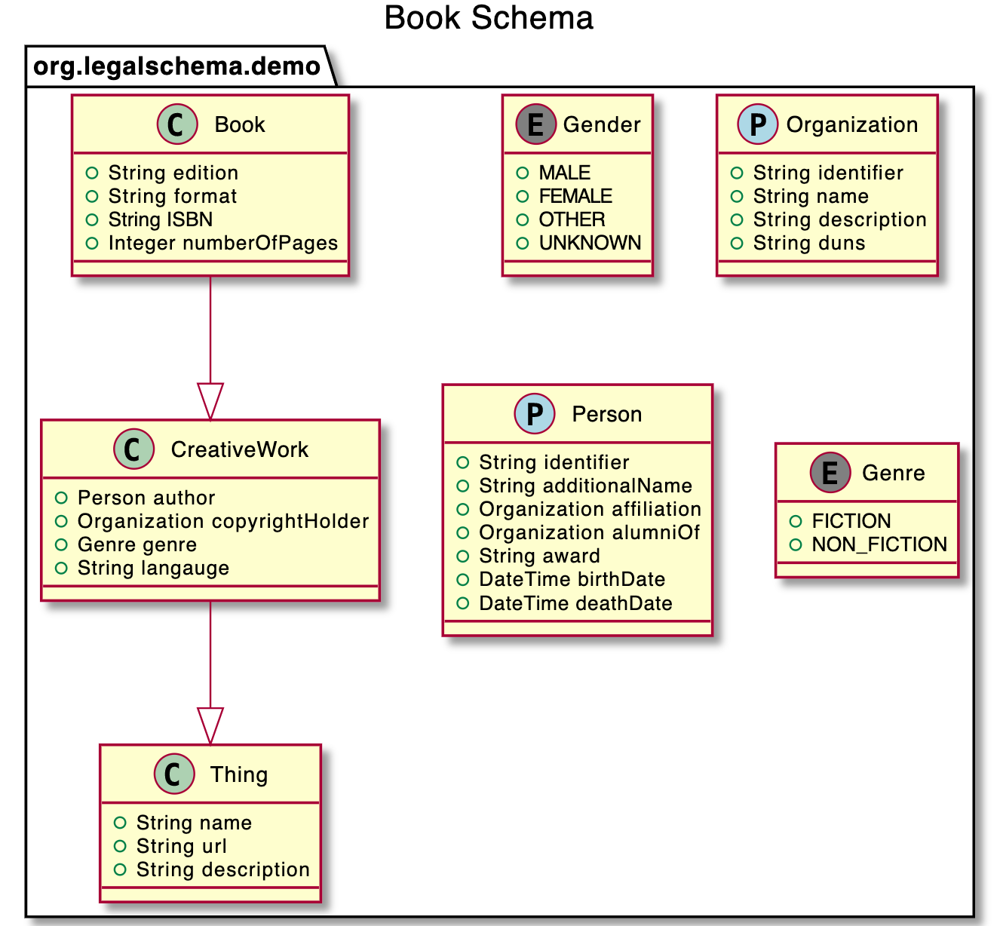

Schemas are used to model domains. A domain may be any specified sphere of activity or knowledge, and can be general or specific in nature. The purpose of schemas is to create open standards for expressing document data, which in turn facilitates interoperability and promotes universality. Schema.org is an example of a foundational domain schema to define and describe core types, such as an event, organisation, person, place, product, and many more. It was devised to create and maintain common schemas for structured data on the internet so that search engines can understand the contents of web pages.

## UK Government Use of Schemas

Open data standards also exist to facilitate the creation and use of structured, useable, data across government.

Legislation in the UK is structured using Crown Legislation Markup Language (CLML) Schema.55 For example, the Video Recordings Act 2010 can be accessed online at http://www.legislation.gov.uk/ukpga/2010/1 and the underlying structured data using the CLML Schema by adding /data.xml at the end. The same structured data can be viewed in PDF by adding /data.pdf. 

Companies House also publish schemas for structuring data on the register, enabling users to submit digital documents programmatically in structured data through the Software Filing service instead through a static document form. For example, the schema for submitting a valid officer appointment is accessible at: http://xmlgw.companieshouse.gov.uk/v1-0/schema/forms/OfficerAppointment-v2-8.xsd. 

Both are prominent examples of critical legal data in documentary form being made designed to be intentionally accessible in an open format. These schemas are important to ensure the both: 
1. the validity and accuracy of the structure of data submitted (as in the case of forms filed at Companies House); and 
2. to facilitate the standardisation, interoperability, and ultimately, use of data contained in these documents with external systems (such as Companies House registration systems or software products using legislation data).

## More information

For more details on using the schema language please refer to the [technical guide](https://docs.accordproject.org/docs/model-concerto.html).